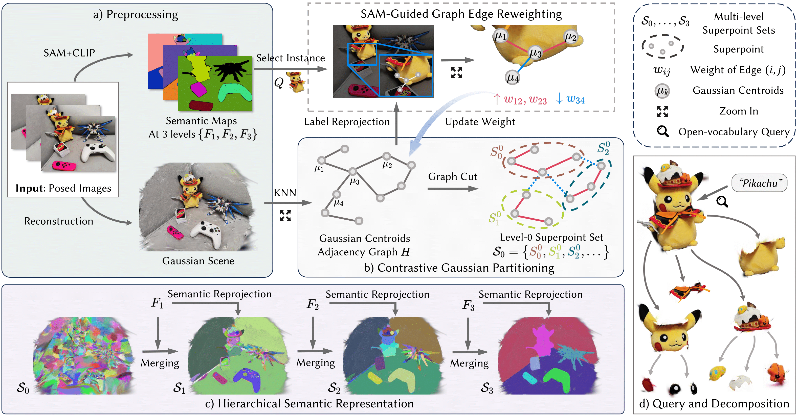
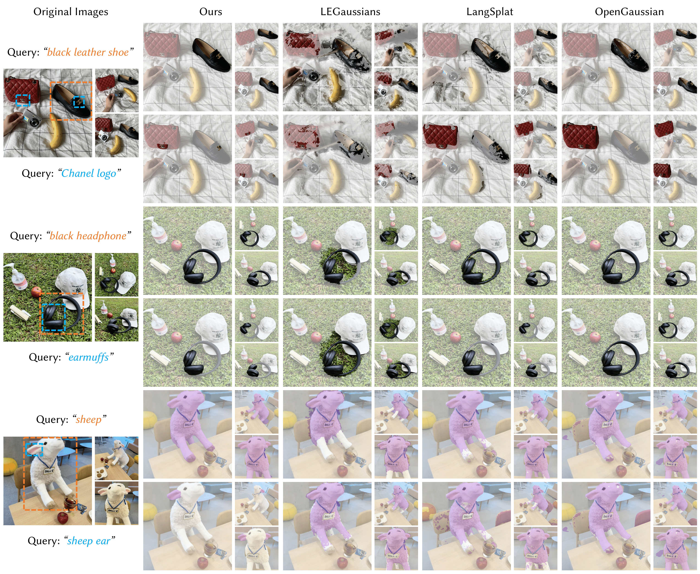
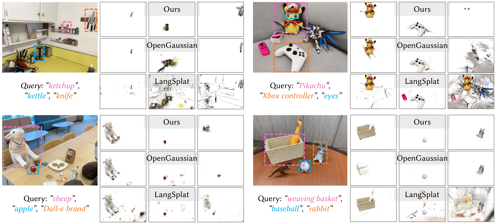

<p align="center">
  <h1 align="center">Training-Free Hierarchical Scene Understanding for Gaussian Splatting with Superpoint Graphs <a href="https://arxiv.org/abs/2504.13153"></a> </h1>


> **😊 TL;DR**
>
> THGS enables open-vocabulary, hierarchical 3D segmentation and interaction on Gaussian scenes — without any training.


## 🧭 Framework Overview


*a) Preprocessing:* Scene reconstruction and extraction of 2D semantic maps.  
*b) Contrastive Gaussian Partitioning:* A Gaussian adjacency graph is created, and its edge weights are adjusted using SAM-guided contrastive cues. The scene is then partitioned into superpoints.  
*c) Hierarchical Semantic Representation:* Superpoints are progressively merged to form a multi-level superpoint graph, while semantic features are reprojected onto each level.  
*d) Query and Decomposition:* The resulting hierarchical graph enables open-vocabulary query and part-based decomposition of scene objects.


## 🔧 Installation
We recommend using **CUDA 11.8** for compatibility with PyTorch 2.2 and related dependencies.


- Step 1: Clone the repository
```
git clone https://github.com/Atrovast/THGS.git --recursive
cd THGS
```

- Step 2: Create new conda environment, and install dependencies
```
conda env create -f environment.yml
conda activate thgs

# install additional dependencies
pip install pyg_lib torch_scatter torch_cluster -f https://data.pyg.org/whl/torch-2.2.0+cu118.html
python scripts/setup_dependencies.py build_ext
```


## 📚 Datasets

You can download the datasets from the following links:

- [LERF-OVS](https://drive.google.com/file/d/1QF1Po5p5DwTjFHu6tnTeYs_G0egMVmHt/view?usp=sharing) (from LangSplat) 
- [3DOVS](https://drive.google.com/drive/folders/1kdV14Gu5nZX6WOPbccG7t7obP_aXkOuC?usp=sharing).

To generate language features for each scene, run:

```shell
python scripts/image_encoding.py --source_path <scene_path>
# Example:
# python scripts/image_encoding.py --source_path data/lerf/figurines
```
> **⚠️ Note:** 
> Our dataset structure and image features are fully compatible with LangSplat. 
> If you have already prepared features using LangSplat, you can safely skip this step.


## 🚋 Training
Our method builds 3D semantic fields on top of 2DGS scenes. For convenience, we provide a set of [**ready-to-use scenes**](https://drive.google.com/drive/folders/1b3bXy8XENhvpWh4nLzu06UPBZEZNX6fG?usp=sharing) (including 2DGS + semantic field) that can be used directly for evaluation and visualization.

### Step 1: Prepare the 2DGS scene
To begin, follow the training process from the original [2DGS project](https://github.com/hbb1/2d-gaussian-splatting) to generate the necessary scene representation. 

After training is completed, copy the resulting scene folder (typically located under output/) into the directory of this project.

### Step 2: Construct the 3D semantic field
Once you have a trained 2DGS scene, run the following command to generate the 3D semantic field:

```shell
bash scripts/run.sh <config_file> [scenes]
```

Our pipeline is organized into modular components, and we provide a launcher script to run the entire pipeline. 
<details>
<summary>The `run.sh` script will execute the following steps:</summary>

1. **Adjacency Graph Construction** (`sp_partition.py`): Partitions the Gaussian Centroids Adjacency Graph into superpoints.

2. **Graph Edge Reweighting** (`graph_weight.py`): Adjusts the edge weights of the superpoint graph using SAM-guided contrastive cues.

3. **Superpoint Partitioning** (`sp_partition.py`): Builds a hierarchical superpoint graph with semantic features.

4. **Hierarchical Semantic Representation** (`merge_proj.py`): Merges superpoints to create a multi-level superpoint graph, reprojecting semantic features onto each level.

</details>

You can also run modules individually, refer to the shell script `scripts/run.sh` for details.

Modify `configs/xxx.yml` to set dataset paths and output locations. There are also memory-related parameters to better fit your GPU. The default configuration is tested for **24GB GPUs**.

If you want to run the pipeline on a specific scene (instead of all scenes in the dataset), you can specify the scene names as additional arguments in the command line. For example, to run on the scenes "figurines" and "ramen", use:

```shell
bash scripts/run.sh configs/lerf.yml figurines ramen
```


## Evaluation

Run the following commands to evaluate open-vocabulary segmentation on the LERF-OVS dataset.
The script `test_lerf.py` will test each scene individually and save the predicted segmentation masks to the specified directory.
The script `scripts/eval_seg.py` will then evaluate the predictions across all scenes.

```shell
for sc in figurines ramen teatime waldo_kitchen; do
    python test_lerf.py -s <dataset path>/$sc -m <model path>/$sc --path_pred <mask saving path>
done

python scripts/eval_seg.py \
    --dataset lerf \
    --scene_list figurines ramen teatime waldo_kitchen \
    --path_pred <mask saving path> \
    --path_gt <gt mask path>

# Example:
# for sc in figurines ramen teatime waldo_kitchen; do python test_lerf.py -s data/lerf/$sc -m output/lerf/$sc --path_pred output/render/lerf; done
# python scripts/eval_seg.py --dataset lerf --scene_list figurines ramen teatime waldo_kitchen --path_pred output/render/lerf --path_gt data/lerf/label
```


Additionally, you can visualize the results using our GUI by running: 
```shell
python gui/main.py --config gui/configs.yaml
```
**TBD**: The GUI is still under development, and we will provide more details soon. In the meantime, you can refer to the [GOI GUI interaction guide](https://github.com/Quyans/GOI-Hyperplane/blob/master/gui/gui_doc.md) as it shares a similar design and functionality.


## ☑️ TODO List
- [x] Code refactoring and release.
- [x] Pre-trained models release.
- [x] GUI for visualization and evaluation.
- [ ] GUI for Interactive segmentation.

## 📖 Experiments

### Open-vocabulary Segmentation on Multi-view 2D Images


We compare our method with LEGaussians, LangSplat, and OpenGaussian. Each scene includes an object- and a part-level query.

### Open-vocabulary 3D Segmentation


We compare our method with OpenGaussian and LangSplat by visualizing the predicted 3D Gaussian primitives. The queried regions are annotated with colored bounding boxes on the original images to indicate object locations.

## Citation

```
@article{thgs2025,
    title={Training-Free Hierarchical Scene Understanding for Gaussian Splatting with Superpoint Graphs},
    author={Dai, Shaohui and Qu, Yansong and Li, Zheyan and Li, Xinyang and Zhang, Shengchuan and Cao, Liujuan},
    journal={arXiv preprint arXiv:2504.13153},
    year={2025}
}
```


## License

Licensed under the CC BY-NC-SA 4.0 (Attribution-NonCommercial-ShareAlike 4.0 International)

The code is released for academic research use only. 


