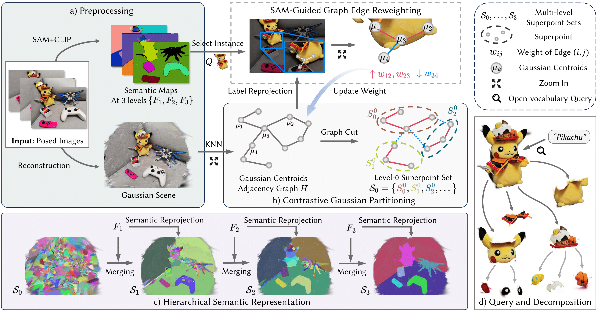
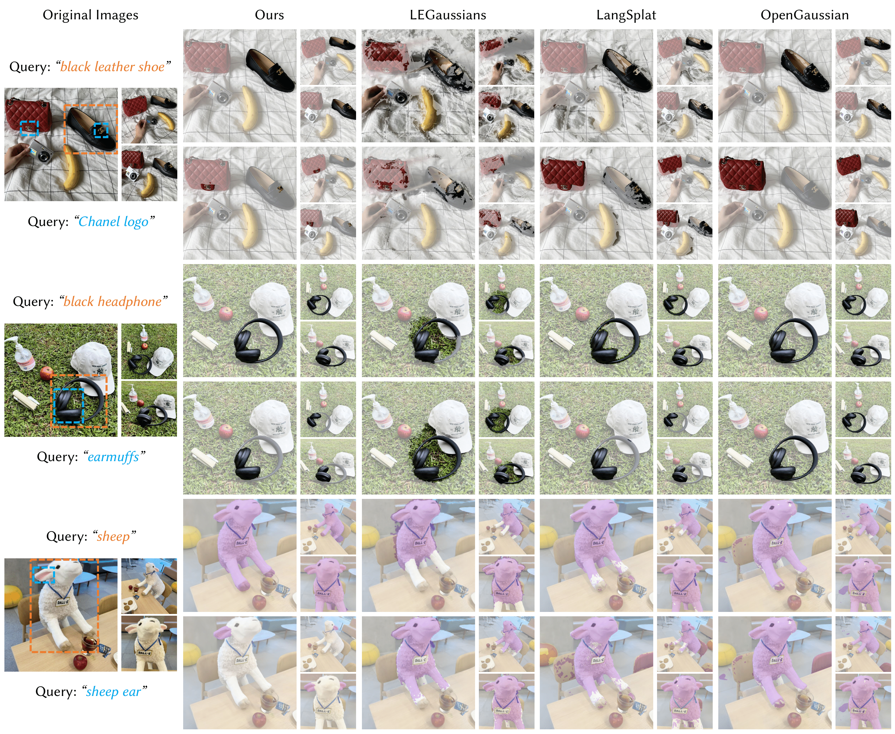
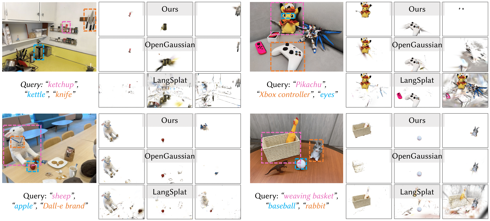

# THGS
Official PyTorch implementation for **"Training-Free Hierarchical Scene Understanding for Gaussian Splatting with Superpoint Graphs"**

## Framework Overview

*a) Preprocessing:* Scene reconstruction and extraction of 2D semantic maps.  
*b) Contrastive Gaussian Partitioning:* A Gaussian adjacency graph is created, and its edge weights are adjusted using SAM-guided contrastive cues. The scene is then partitioned into superpoints.  
*c) Hierarchical Semantic Representation:* Superpoints are progressively merged to form a multi-level superpoint graph, while semantic features are reprojected onto each level.  
*d) Query and Decomposition:* The resulting hierarchical graph enables open-vocabulary query and part-based decomposition of scene objects.

## Experiments

### Open-vocabulary Segmentation on Multi-view 2D Images

We compare our method with LEGaussians, LangSplat, and OpenGaussian. Each scene includes an object- and a part-level query.

### Open-vocabulary 3D Segmentation

We compare our method with OpenGaussian and LangSplat by visualizing the predicted 3D Gaussian primitives. The queried regions are annotated with colored bounding boxes on the original images to indicate object locations.
